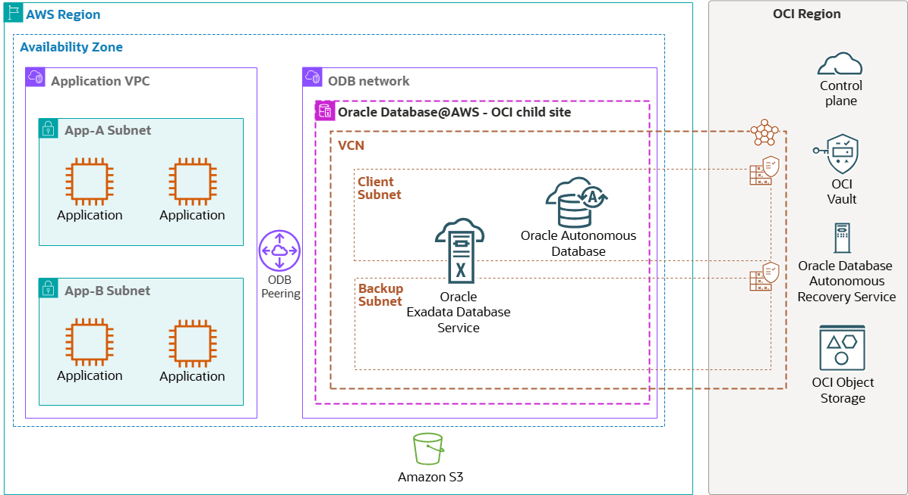

# Get started - Oracle Database@AWS

## Introduction

Oracle Database@AWS is a cloud database service that lets you to access OCI managed Oracle Exadata infrastructure inside AWS data centers.

The service lets you to migrate on-premises Oracle workloads to AWS, giving your business-critical applications low-latency connectivity to your Oracle Databases. With Oracle Database@AWS, you also have access to Oracle Real Application Clusters (RAC) and Oracle Exadata performance for mission-critical applications in AWS. The service integrates with other AWS services, and you get a single invoice through AWS Marketplace that includes Oracle Database@AWS billing. Oracle Database@AWS usage counts toward AWS commitments and Oracle Support rewards.

All hardware for Oracle Database@AWS uses AWS networking. The service benefits from the simplicity, security, and low latency of a single operating environment within AWS.

### Available Database Services

Oracle Database@AWS offers the following Oracle Database services:

* Oracle Exadata Database Service on Dedicated Infrastructure
* Oracle Autonomous Database on Dedicated Exadata Infrastructure

Both Exadata Database Service on Dedicated Infrastructure and Autonomous Database on Dedicated Exadata Infrastructure use the same underlying high-performance hardware optimized for database workloads, but they each offer distinct advantages to meet different customer needs.

### Service Overview

To use the service, you configure it within your AWS account through a process referred to as onboarding. To begin onboard, contact your Oracle representative and request a Private Offer. After you agree on pricing, terms and conditions, you complete the purchase through AWS Marketplace. After the purchase is complete, you link your AWS account with an OCI tenancy. This is called multicloud linking.

After you complete onboarding, you can begin provisioning the Oracle Database@AWS system resources for Exadata Database Service on Dedicated Infrastructure and Autonomous Database on Dedicated Exadata Infrastructure. Provisiong starts with creating an ODB network and Exadata infrastructure. Based on your workloads and requirements, you then create either an Exadata VM cluster for the Oracle Exadata Database Service, or an Autonomous VM Cluster for Autonomous Database on Dedicated Exadata Infrastructure.

When your database resources are available, you establish a connectivity between your application VPC and the ODB network through a process called ODB peering. This enables a direct, secure, and low latency connection between applications and Oracle Database@AWS.

Estimated Time: 30 minutes

### Objectives

As a database user, DBA, or application developer:

1. Onboarding to Oracle Database@AWS

## Onboarding to Oracle Database@AWS

Before getting started with Oracle Database@AWS, ensure you have an active AWS account and have created the required user roles. Once set up, you can subscribe to Oracle Database@AWS through the AWS Marketplace by accepting a private offer from Oracle.

You can find more information about onboarding [here](https://docs.aws.amazon.com/odb/latest/UserGuide/setting-up.html).

## Oracle Database@AWS Architecture

Oracle Database@AWS is an offering that enables you to access Oracle Exadata infrastructure managed by Oracle Cloud Infrastructure (OCI) inside AWS data centers. You can migrate your Oracle Exadata workloads, establish low-latency connectivity with applications running on AWS, and integrate with AWS services. You get a single invoice through AWS Marketplace, which counts towards AWS commitments and Oracle Support rewards.

The following high-level architecture diagram shows how an OCI region (parent site) is connected with an AWS region's Availability Zone (child site) through an OCI managed network as part of Oracle Database@AWS. An application server deployed on Amazon EC2 connects to the Oracle Databases deployed in an Oracle Database (ODB) network through ODB peering. The control plane, which is highly available and fault-tolerant, is deployed in the OCI Region and offers a seamless database management and administration experience.

   

You may now **proceed to the next lab**.

## Acknowledgements

* **Authors/Contributors** - Vivek Verma, Master Principal Cloud Architect, North America Cloud Engineering
* **Last Updated By/Date** - Vivek Verma, July 2025
