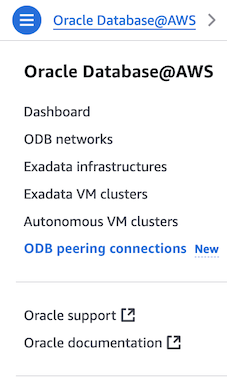

# Create VPC and ODB Network for Oracle Database@AWS

## Introduction

This lab walks you through the steps required as a pre-requisites for provisioning Exadata Infrastructure, VM Cluster through AWS Console. It involves creating a VPC and ODB Network in AWS as pre-requisite steps.

An **ODB network** is a private network that hosts Oracle VM Clusters in a specified availability zone (AZ). You can set up peering between an ODB network and an AWS virtual private cloud (VPC), which allows applications to connect to your Oracle Database.

The ODB network is a private network, and by default, doesn't have connectivity to AWS VPCs, on-premises network or the internet. To connect to Exadata Databases in the ODB network privately, customers can set up a peering connection between one VPC and the ODB network. This peering between ODB Network and the VPC is referred to as ODB peering. We will perform ODB peering in the next lab.

Estimated Time:  30 Minutes

### Objectives

In this lab, you will learn about, how to :

* Create AWS VPC
* Create ODB Network in AWS Console
* Create an ODB peering connection
* Update VPC Route Rules

### Prerequisites  

This lab assumes you have:
- An existing AWS Account
- DB@AWS private offer signed and onboarding completed
- Received and Accepted private offer for Oracle Database@AWS

##  Task 1: Create AWS VPC

1. Open the Amazon VPC console at https://console.aws.amazon.com/vpc/.

2. On the VPC dashboard, choose **Create VPC**.

   

3. For **Resources to create**, choose **VPC and more**.

4. Keep **Name tag auto-generation** selected to create Name tags for the VPC resources. Enter **project**.

5. For **IPv4 CIDR block**, enter an IPv4 address range for the VPC. Enter **10.0.0.0/24**.

6. Leave defaults for **IPv6 CIDR block** and **Tenancy**.

7. For **Number of Availability Zones (AZs)**, we recommend that you provision subnets in at least two Availability Zones for a production environment. Select **3**.

8. To configure your subnets, choose values for **Number of public subnets** and **Number of private subnets**. To choose the IP address ranges for your subnets, expand **Customize subnets CIDR blocks**. Select the values as per the screenshot.

   

9. Select **None** for **NAT Gateways**. If resources in a private subnet need access to the public internet over IPv4, for NAT gateways, choose the number of AZs in which to create NAT gateways. In production, we recommend that you deploy a NAT gateway in each AZ with resources that need access to the public internet. Note that there is a cost associated with NAT gateways.

   

10. If you need to access Amazon S3 directly from your VPC, choose **VPC endpoints**, **S3 Gateway**. This creates a gateway VPC endpoint for Amazon S3. Select **S3 Gateway** for **VPC endpoints**.

11. For **DNS options**, both options for domain name resolution are enabled by default. Leave as default.

12. When you are finished configuring your VPC, choose **Create VPC**.

13. In the **Preview** pane, you can visualize the relationships between the VPC resources that you've configured. Solid lines represent relationships between resources. Dotted lines represent network traffic to NAT gateways, internet gateways, and gateway endpoints. After you create the VPC, you can visualize the resources in your VPC in this format at any time using the Resource map tab. For more information, see Visualize the resources in your VPC.

   

##  Task 2: Create ODB Network in AWS Console

An ODB network is a private isolated network that hosts OCI infrastructure on AWS. The ODB network maps directly to the network that exists within the OCI child site, thus serving as the means of communication between AWS and OCI.

1. Launch the Oracle Database@AWS console at https://console.aws.amazon.com/odb/.

   

2. Click **Dashboard** to go to the console.

3. From the left pane, click **ODB networks** and click **Create ODB network**.

   

4. For **ODB network name**, enter **my-odb-network**.

   

5. For **Availability Zone**, choose an AZ name. Select **us-east-1a**.

6. For **Client subnet CIDR**, specify a CIDR range for the client connections. Enter **10.1.0.0/24**.

7. For **Backup subnet CIDR**, specify a CIDR range for the backup connections. Enter **10.2.0.0/25**.

8. For **DNS configuration**, choose **Default**.

9. Leave the rest as defaults and click **Create ODB Network**.

   

10. Verify when the ODB Network status is *Available*.

   

##  Task 3: Create an ODB peering connection in Oracle Database@AWS

1. Launch Oracle Database@AWS console at https://console.aws.amazon.com/odb/.

2. In the navigation pane, choose **ODB peering connections** and click on **Create ODB peering connections**.

   

3. For **ODB peering name**, enter **my-odb-peering**.

   

4. For **ODB Network**, choose the ODB network that was created in Task 2 - **my-odb-network**.

5. For **Peer Network**, choose the Amazon VPC to peer with your ODB network. Select the VPC ID of the VPC that was created in Task 1.

6. Click **Create ODB peering connection**.

## Task 4: Update VPC Route Rules

1. After creating an ODB peering connection, configure your Amazon VPC route tables to route traffic to the peered ODB network. For more information, see [Configuring VPC route tables for ODB peering](https://docs.aws.amazon.com/odb/latest/UserGuide/configuring.html#configure-routes).

2. To update a route table, use the AWS CLI ec2 *create-route command*. The following example updates Amazon VPC route tables.

```
<copy>
aws ec2 create-route \
    --route-table-id rtb-1234567890abcdef \
    --destination-cidr-block 10.0.0.0/16 \
    --odb-network-arn arn:aws:odb:us-east-1:111111111111:odb-network/odbnet_1234567890abcdef
</copy>
```

- For *--route-table-id* use the Route Table ID for Route Table associated with the Public Subnet that was created in Task 1.

   

   

- For destination-cidr-block use the **Client Subnet CIDR** of the ODB Network created in Task 2.

   

- For odb-network-arn use the ARN for the ODB Network created in Task 2.

You may now **proceed to the next lab**.

## Learn More

- You can find more information about Oracle Exadata Database@AWS [here](https://docs.oracle.com/en-us/iaas/Content/database-at-aws/oaaws.htm)

## Acknowledgements
* **Author** - Vivek Verma, Master Principal Cloud Architect, North America Cloud Engineering
* **Last Updated By/Date** - Vivek Verma, July 2025