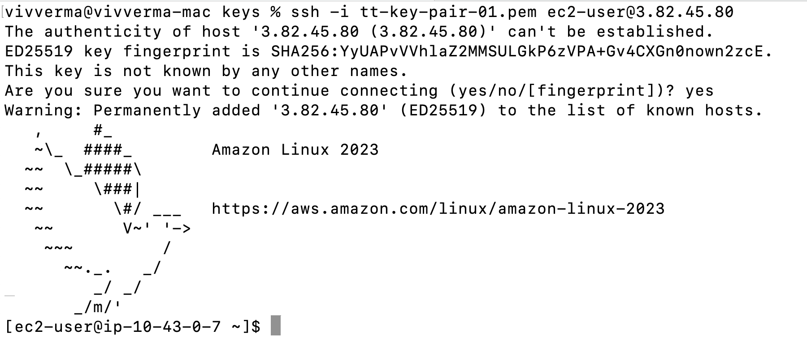
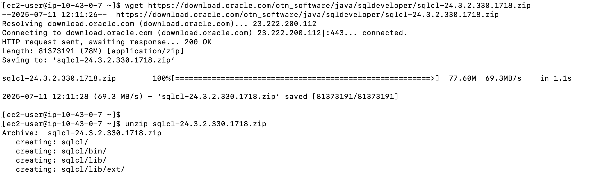
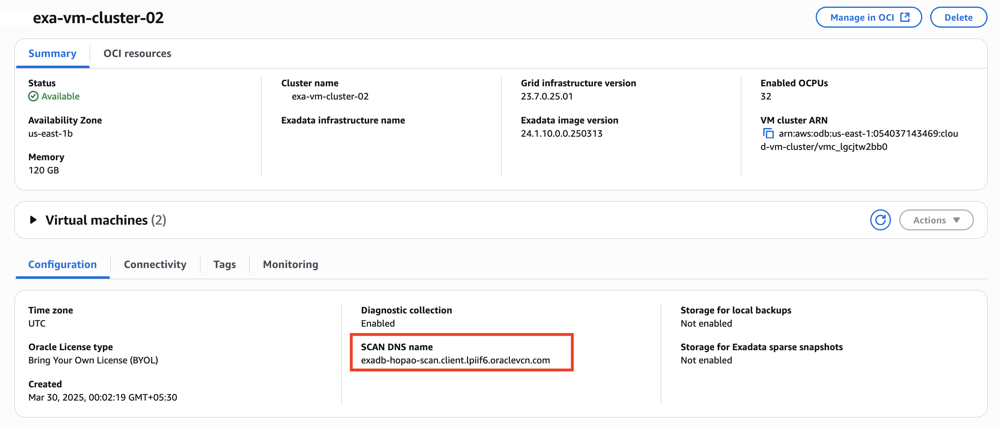
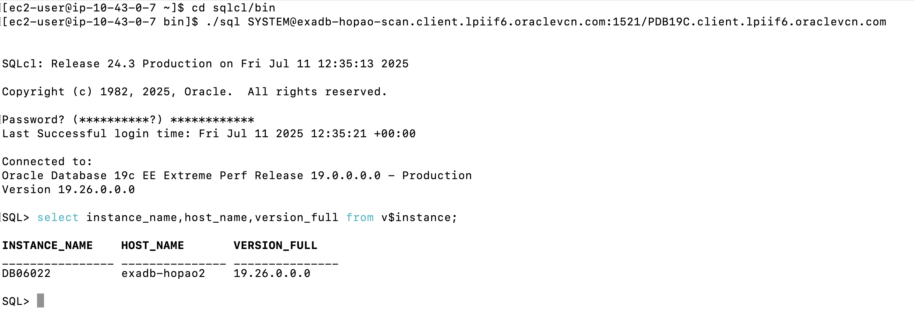
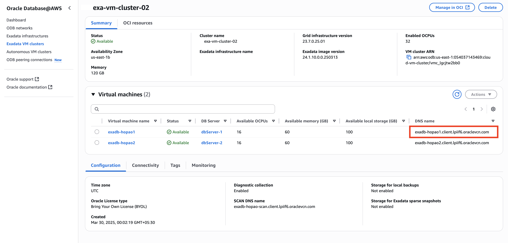
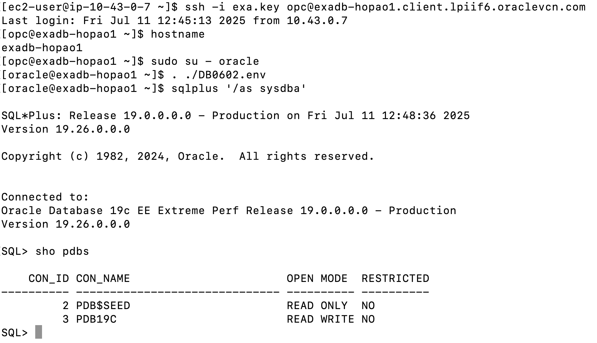

# Connect Oracle Database@AWS from AWS EC2

## Introduction

This lab walks you through the steps to connect to Oracle Database@AWS from an AWS EC2 instance.

Estimated Time:  45 Minutes

### Objectives

In this lab, you will learn to :

* Configure DNS in AWS
* Create an AWS EC2 instance
* Connect to Oracle Database@AWS

### Prerequisites  

This lab assumes you have:

- Created Exadata Cloud Infrastructure
- Created Exadata VM Cluster
- Created Oracle Database on DB@AWS

## Task 1: Configure DNS in AWS

1. Configure DNS in AWS to connect to Oracle Database@AWS using the Fully Qualified Domain Name (FQDN) for Scan and Virtual Machine (VM Cluster). 

    *If you do not configure DNS you can not perform Task 2 and Task 3 using the FQDN for Scan and VM. You have to perform that using the IP address of the VM.*

    Refer to the official AWS documentation on [Configuring DNS for Oracle Database@AWS](https://docs.aws.amazon.com/odb/latest/UserGuide/configuring.html#configuring-dns).

2. Following above documentation perform **Configuring an outbound endpoint in an ODB network in Oracle Database@AWS**

3. Follow **Configuring a resolver rule in Oracle Database@AWS**.


##  Task 2: Connect to Oracle Database@AWS

1. Refer [Launch an EC2 instance](https://docs.aws.amazon.com/AWSEC2/latest/UserGuide/EC2_GetStarted.html#ec2-launch-instance) and provision an AWS EC2 instance.

2. The instance needs to be provisioned in the same AWS VPC that was created in Lab 1 - **project-vpc** and in a *Public Subnet*.

3. Connect to the EC2 instance.

    

4. Here, we will use **SQLcl** to demonstrate the steps needed to connect to Oracle Database@AWS.

5. Download and install SQLcl on AWS EC2 instance.

You can download SQLcl from https://download.oracle.com/otn_software/java/sqldeveloper/sqlcl-24.3.2.330.1718.zip

6. After downloading SQLcl unzip the zip file.

    ```
    <copy>
    wget https://download.oracle.com/otn_software/java/sqldeveloper/sqlcl-24.3.2.330.1718.zip
    unzip sqlcl-24.3.2.330.1718.zip
    </copy>
    ```

    

*SQLcl requires Java 11 and above to run. Check the java version and install Java 11 or above if required.*

7. Obtain the SCAN DNS name and Database Service Name to connect to the database.

    

    

8. Connect to the database from EC2 instance using SQLcl.

    ```
    <copy>
    $ cd sqlcl/bin
    $ ./sql username@scan-dns-name:1521/db-service-name
    </copy>
    ```

    

##  Task 3: Connect to Oracle Database@AWS VM Cluster

1. Connect to the EC2 instance.

2. Obtain the DNS Name of the VM Machine to connect to the cluster VM.

        

3. ssh to the VM. Connect using the key that was used while creating the VM cluster.

    ```
    <copy>
    $ ssh -i exa.key opc@exadb-hopao1.client.lpiif6.oraclevcn.com
    $ hostname
    $ sudo su - oracle
    $ ls -ltr
    $ . ./db_name.env
    $ sqlplus '/as sysdba'
    SQL> sho pdbs
    </copy>
    ```

        

## Learn More

- You can find more information about Oracle Exadata Database@AWS [here](https://docs.oracle.com/en-us/iaas/Content/database-at-aws/oaaws.htm)

## Acknowledgements
* **Author** - Vivek Verma, Master Principal Cloud Architect, North America Cloud Engineering
* **Last Updated By/Date** - Vivek Verma, July 2025