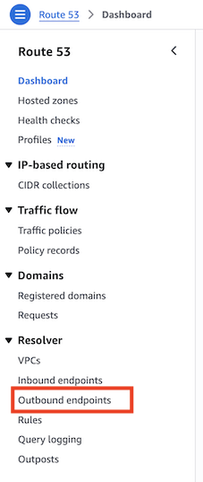
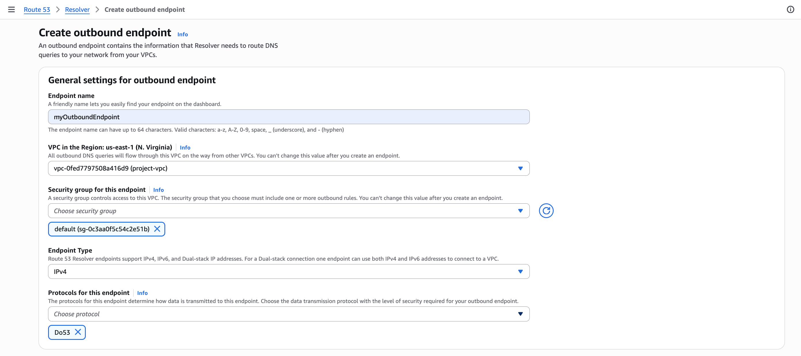
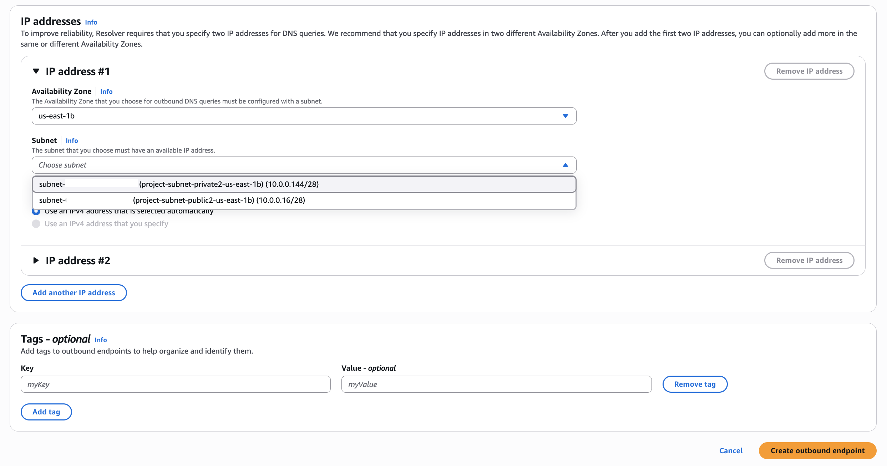
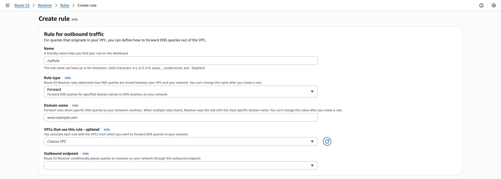
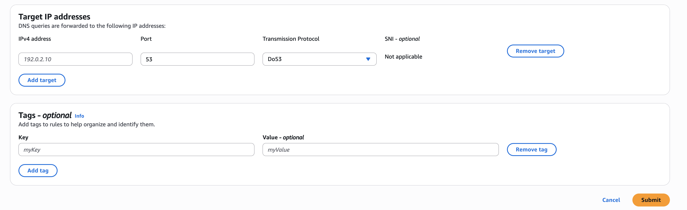

# Connect Oracle Database@AWS from AWS EC2

## Introduction

This lab walks you through the steps to connect to Oracle Database@AWS from an AWS EC2 instance.

Estimated Time:  45 Minutes

### Objectives

In this lab, you will learn to :

* Configure DNS in AWS
* Create an AWS EC2 instance
* Connect to Oracle Database@AWS

### Prerequisites  

This lab assumes you have:

- Created Exadata Cloud Infrastructure
- Created Exadata VM Cluster
- Created Oracle Database on DB@AWS

## Task 1: Configure DNS in AWS

1. Configure **DNS Resolution**

    This section enables apps (EC2, Lambda, ECS etc) to connect to the Oracle database using its Fully Qualified Domain Name (FQDN). As part of this configuration, outbound endpoints will be created in Amazon Route 53 to facilitate DNS resolution.

2. Create **Output Endpoint** in **Route 53**.

    - Launch the **Route 53** console at https://console.aws.amazon.com/route53/.

    - From the left pane, select **Outbound Endpoints** under the **Route 53 Resolver** section.

        

    - Click **Create Outbound Endpoint** and enter the following:

        
        
        

        * **Endpoint Name** - Name of the Endpoint - *myOutboundEndpoint*
        * **VPC** - choose the VPC that is peered with ODB network - *project-vpc*
        * **Security Group** - Select the correct Security Group under that VPC.
            
            The Security Group should have following rules -
            * Set inbound rules to allow TCP and UDP port 53 from the CIDR blocks of all VPCs associated with the resolver rule. 
            * Set outbound rules to allow TCP and UDP port 53 to the target DNS Listener IP, or to 0.0.0.0/0

        * **Endpoint Type** - *IPV4*
        * **Protocol** - *Do53*
        * In **IP addresses**, provide the following information:
        
            * Select the same **Availability Zone** where the ODB Network is provisioned - *us-east-1b*
            * For **Subnet**, choose subnets that has Route tables that include routes to the IP addresses of the DNS listener on ODB network. Select the Public Subnet that has the routes to ODB Network. 

        * Click **Create outbound endpoint**.
        
3. Create a **Resolver Rule** for DNS Forwarding
    
    After creating the Outbound Resolver Endpoint, create a Resolver Rule to forward DNS queries:
        
    - From the left pane on the **Route 53** console, choose **Rules** and click **Create rule**.

    - Complete the **Rule for outbound traffic** sections as follows:

        

        

        * **Name**: *myRule* 
        
        * **Rule type**: *Forward*

        * **Domain name**: Specify the full domain name from ODB network

        * **VPCs that use this rule**: Associate it with the VPC from where DNS queries are forwarded to your ODB network - *project-vpc*

        * **Outbound endpoint**: Choose the outbound endpoint that you created in Task 2 - *myOutboundEndpoint*

    - Complete the **Target IP addresses** section as follows:

        * **IP address**: Specify the IP address of the DNS listener IP on your ODB network.

        * **Port**: *53*

            *The Route 53 Resolver forwards DNS queries that match this rule and originate from a VPC associated with this rule to the referenced outbound endpoint. These queries are forwarded to the target IP addresses that you specify in the Target IP addresses.*

        * **Transmission protocol**: *Do53*
        
        * Click **Submit**.

##  Task 2: Connect to Oracle Database@AWS

1. Refer [Launch an EC2 instance](https://docs.aws.amazon.com/AWSEC2/latest/UserGuide/EC2_GetStarted.html#ec2-launch-instance) and provision an AWS EC2 instance.

2. The instance needs to be provisioned in the same AWS VPC that was created in Lab 1 - **project-vpc** and in a *Public Subnet*.

3. Connect to the EC2 instance.

    

4. Here, we will use **SQLcl** to demonstrate the steps needed to connect to Oracle Database@AWS.

5. Download and install SQLcl on AWS EC2 instance.

You can download SQLcl from https://download.oracle.com/otn_software/java/sqldeveloper/sqlcl-24.3.2.330.1718.zip

6. After downloading SQLcl unzip the zip file.

    ```
    <copy>
    wget https://download.oracle.com/otn_software/java/sqldeveloper/sqlcl-24.3.2.330.1718.zip
    unzip sqlcl-24.3.2.330.1718.zip
    </copy>
    ```

    

*SQLcl requires Java 11 and above to run. Check the java version and install Java 11 or above if required.*

7. Obtain the SCAN DNS name and Database Service Name to connect to the database.

    

    

8. Connect to the database from EC2 instance using SQLcl.

    ```
    <copy>
    $ cd sqlcl/bin
    $ ./sql username@scan-dns-name:1521/db-service-name
    </copy>
    ```

    

##  Task 3: Connect to Oracle Database@AWS VM Cluster

1. Connect to the EC2 instance.

2. Obtain the DNS Name of the VM Machine to connect to the cluster VM.

        

3. ssh to the VM. Connect using the key that was used while creating the VM cluster.

    ```
    <copy>
    $ ssh -i exa.key opc@exadb-hopao1.client.lpiif6.oraclevcn.com
    $ hostname
    $ sudo su - oracle
    $ ls -ltr
    $ . ./db_name.env
    $ sqlplus '/as sysdba'
    SQL> sho pdbs
    </copy>
    ```

        

## Learn More

- You can find more information about Oracle Exadata Database@AWS [here](https://docs.oracle.com/en-us/iaas/Content/database-at-aws/oaaws.htm)
- Refer to the official AWS documentation on [Configuring DNS for Oracle Database@AWS](https://docs.aws.amazon.com/odb/latest/UserGuide/configuring.html#configuring-dns).


## Acknowledgements
* **Author** - Vivek Verma, Master Principal Cloud Architect, North America Cloud Engineering
* **Last Updated By/Date** - Vivek Verma, July 2025