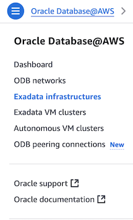
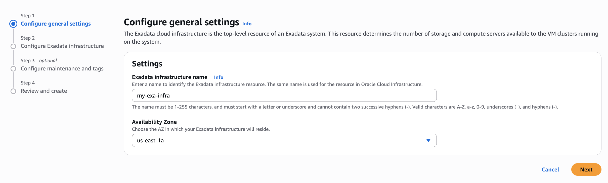
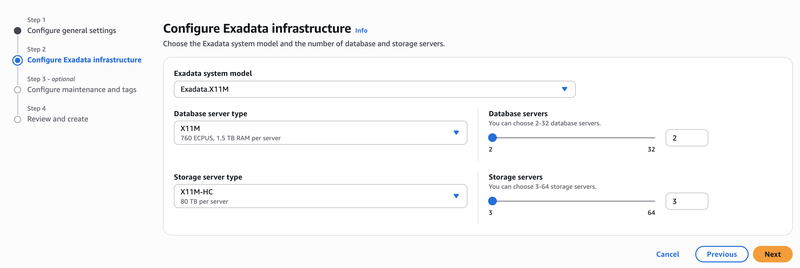
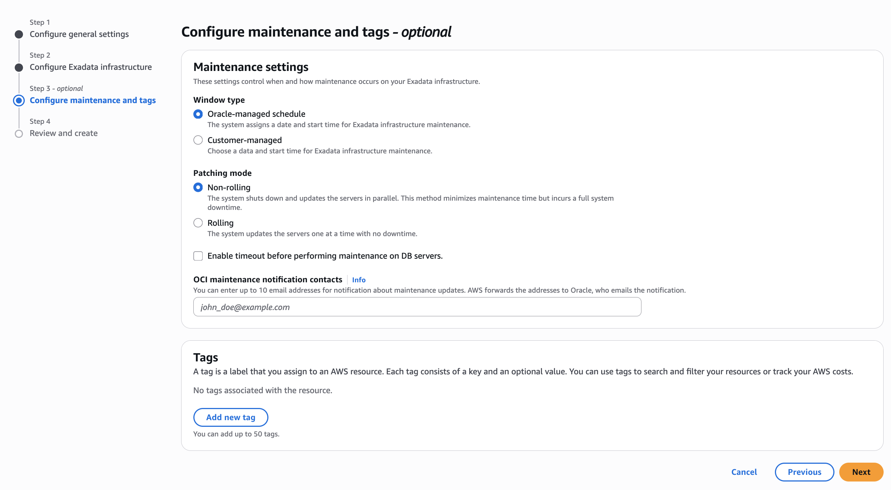
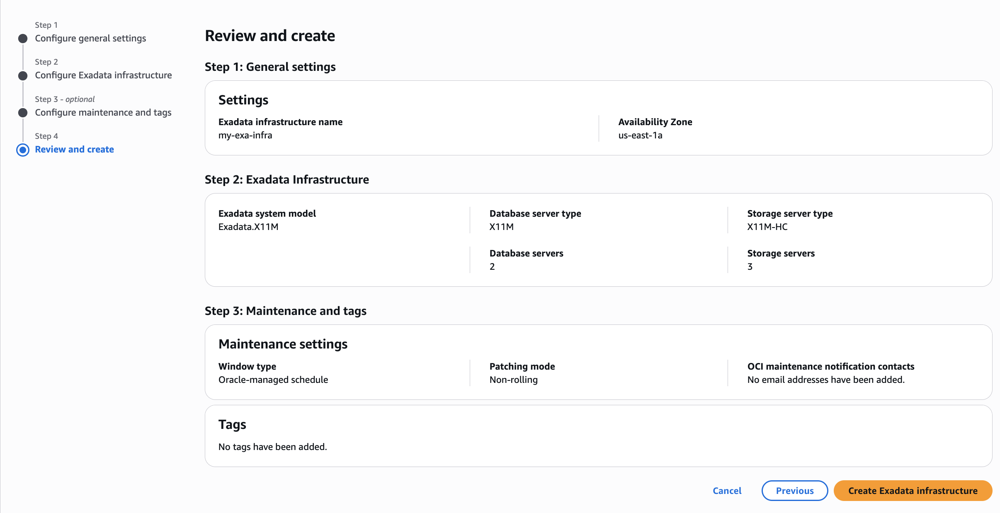

# Create Oracle Exadata Infrastructure

## Introduction

This lab walks you through the steps to provision Exadata Cloud Infrastructure.

Estimated Time:  45 Minutes

### Objectives

In this lab, you will learn to :

* Provision an Exadata Cloud Infrastructure resource using AWS Console.

### Prerequisites  

This lab assumes you have:

* Created AWS VPC
* Created the ODB Network
* Performed ODB Peering with AWS VPC
* Created Route Rules for AWS VPC

## Task 1: Provision Exadata Cloud Infrastructure

1. Launch the Oracle Database@AWS console at https://console.aws.amazon.com/odb/.

2. From the left pane, choose **Exadata infrastructures** and click **Create Exadata infrastructure**.

   

3. For **Exadata infrastructure name**, enter **my-exa-infra**.

   

4. For Availability Zone, choose **us-east-1a**. Click **Next**

5. For **Exadata system model**, choose either Exadata.X9M or Exadata.X11M. For this lab select **Exadata.X11M**.

   

6. For **Database server type**, choose the database server model type of your Exadata infrastructure. Currently, the only choice is X11M.

7. For **Storage server type**, choose the storage server model type of your Exadata infrastructure. Currently, the only choice is X11M-HC.

8. For **Database servers**, leave the default of 2.

   Each database server supports 126 compute units, which are measured in ECPUs for Exadata X11M and OCPUs for Exadata X9M. The total compute count changes as you change the number of servers.

9. For **Storage servers**, leave the default of 3.

   Each storage server provides 64 TB. The total TB of storage changes as you change the number of servers. 

10. Click **Next**.

11. Leave the defaults for **Maintenance settings**.

   

      *Maintenance Window Type has following options:*

      *Oracle-managed schedule - Oracle determines the optimal time for maintenance activities.*

      *Customer-managed schedule - You specify when maintenance activities can occur.*

      *Patching mode, has following options:*

      *Rolling - Updates are applied to one node at a time, allowing the database to remain available during patching.*

      *Non-rolling - Updates are applied to all nodes simultaneously, which may require downtime.*

12. Click **Next**.

13. Review your infrastructure settings.

   

14. Click **Create Exadata infrastructure**.

You may now **proceed to the next lab**.

## Learn More

* Official documentation on [Oracle Exadata Database@AWS](https://docs.oracle.com/en-us/iaas/Content/database-at-aws/oaaws.htm)

## Acknowledgements

* **Author** - Vivek Verma, Master Principal Cloud Architect, North America Cloud Engineering
* **Last Updated By/Date** - Vivek Verma, July 2025
