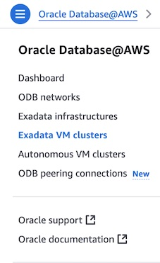
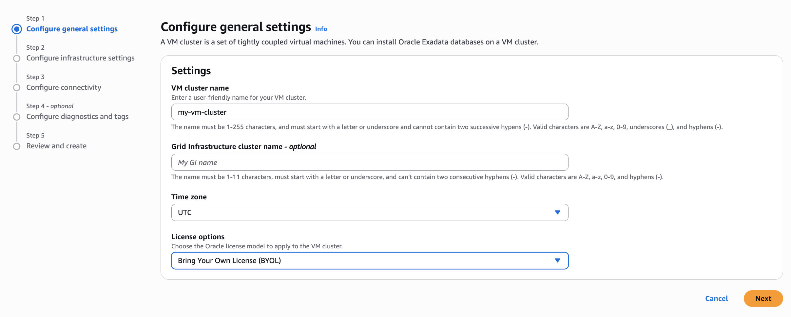
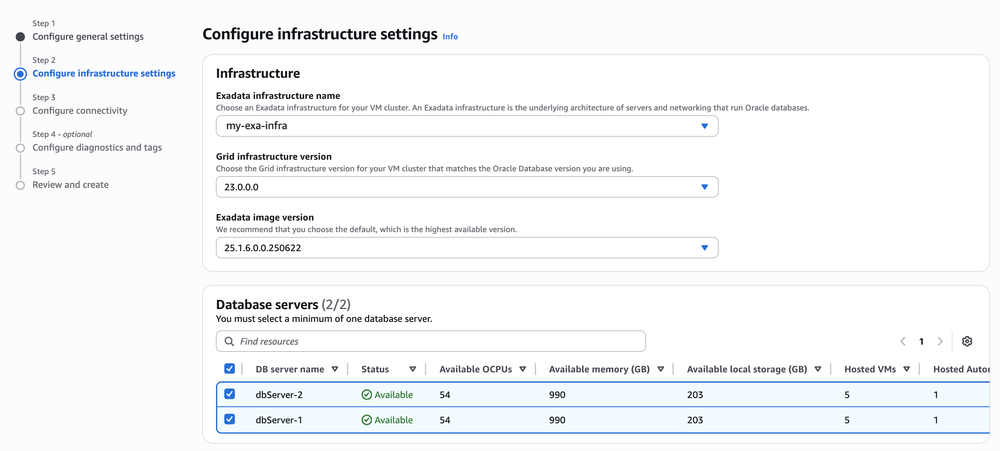
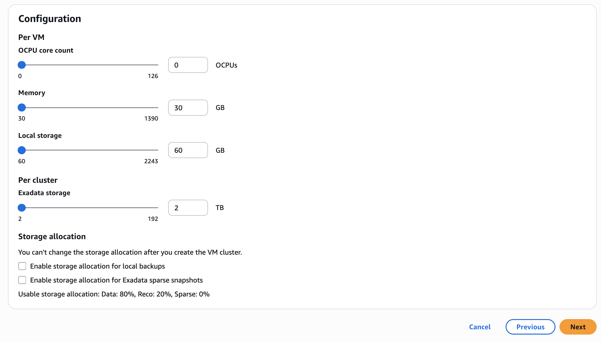
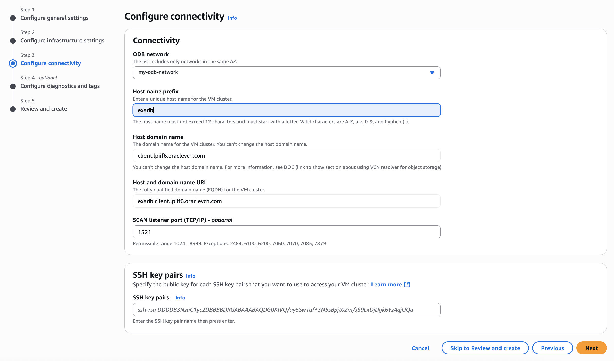
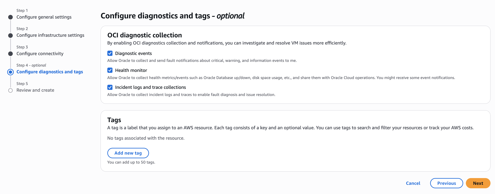

# Create Oracle Exadata VM Cluster

## Introduction

This lab walks you through the steps to provision Exadata VM Cluster from AWS Console.

Estimated Time:  45 Minutes

### Objectives

In this lab, you will learn to :

* Create Exadata VM Cluster using AWS Console.

### Prerequisites  

This lab assumes you have:

* Created AWS VPC
* Created the ODB Network
* Performed ODB Peering with AWS VPC
* Created Route Rules for AWS VPC
* Exadata Cloud Infrastructure resource created

## Task 1: Create Exadata VM Cluster

1. Launch the [Oracle Database@AWS console](https://console.aws.amazon.com/odb/).

2. From the left pane, choose **Exadata VM clusters** and click **Create VM cluster**.

   

3. For **VM cluster name**, enter **my-vm-cluster**.

   

4. Leave blank for **Grid Infrastructure cluster name** as it is optional.

5. For **Time zone**, select the default value - **UTC**.

6. For **License options**, choose **Bring Your Own License (BYOL)**.

7. Click **Next**.

8. Configure Exadata infrastructure settings as follows:

   

   For Infrastructure, choose the following:

   For **Exadata infrastructure name**, choose the infrastructure created in previous lab **my-exa-infra**.

   For **Grid Infrastructure version**, select the default value.

   For **Exadata image version**, select the default value.

   For **Database servers**, select both database servers to host your VM cluster.

9. For Configuration, do the following:

   

   Choose the **OCPU core count**, **Memory**, and **Local storage** for each VM, or accept the defaults.

   Choose the total amount of **Exadata storage** for the VM cluster, or accept the default.

   For **Storage allocation**, leave all as defaults.

   Click **Next**.

10. Configure connectivity as follows:

   

   For **ODB network**, select the ODB network created earlier - **my-odb-network**.

   For **Host name prefix**, enter a prefix for the VM cluster. Enter **exadb**.

   Leave the default value of **1521** for **SCAN listener port (TCP/IP)**.

   For SSH key pairs, enter the public key portion of one or more key pairs used for SSH access to the VM cluster.

   Click **Next**.

11. Leave all defaults for **Configure diagnostics and tags**. Click **Next**

   

12. Review your settings and click **Create VM cluster**.

You may now **proceed to the next lab**.

## Learn More

* Official documentation on [Oracle Exadata Database@AWS](https://docs.oracle.com/en-us/iaas/Content/database-at-aws/oaaws.htm)

## Acknowledgements

* **Author** - Vivek Verma, Master Principal Cloud Architect, North America Cloud Engineering
* **Last Updated By/Date** - Vivek Verma, July 2025
